## Underwriting system
Introduction

---

Studium is about to uproot the insurance
IT landscape by proving that IT is not as problematic
as it is experienced with large vendors.

---

The insurer defines the product,
the system presents it in a consistent
manner to all channels: in-house, intermediaries, service providers,
clients facing.

Let's look at what we have. <!-- .element: class="fragment" -->

---

#### Product lifecycle management

Implement new products within days

Adjust and release new product versions within clicks

---

A product definition is a self contained entity.

Once it is done, can be saved into a text file and uploaded to the live
environment, where it is usable instantly.

---

No redeployments!

(...at least not with the out-of-the-box functionality)

---

##### Product = Structure + Business rules

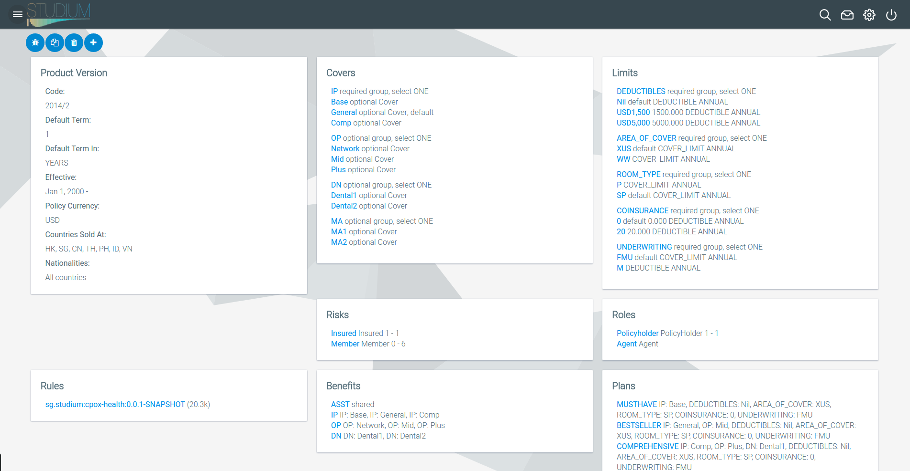

---

... fields included, with formats and constraints.

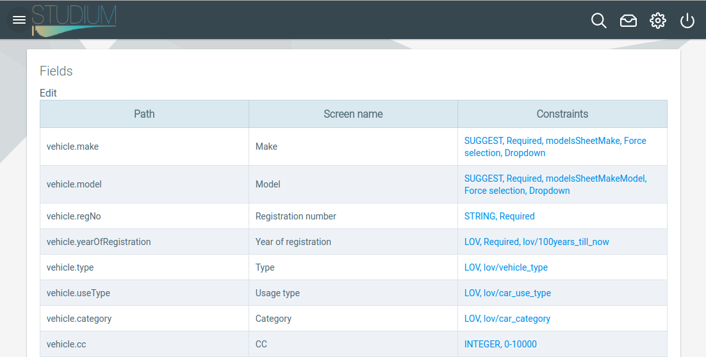

---

...and business rules. We have an integrated rules engine
that does the heavy lifting.

---

A rule is a simple thing:

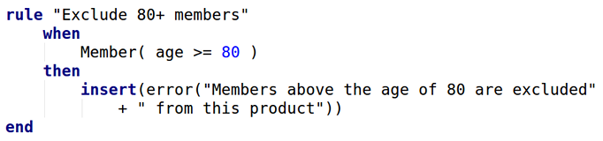

---

The result of all changes can be seen and tested instantly.

Then just upload to production as a new product version.

---

Out of the box client facing UIs

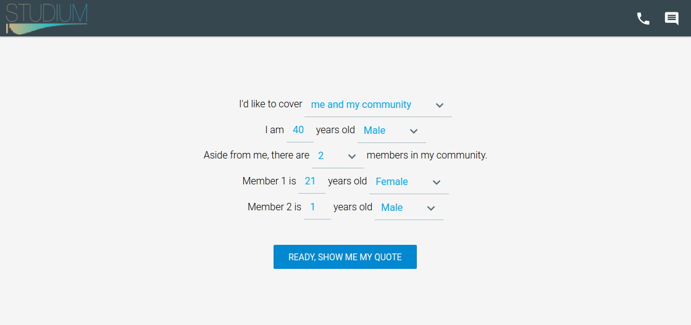

---

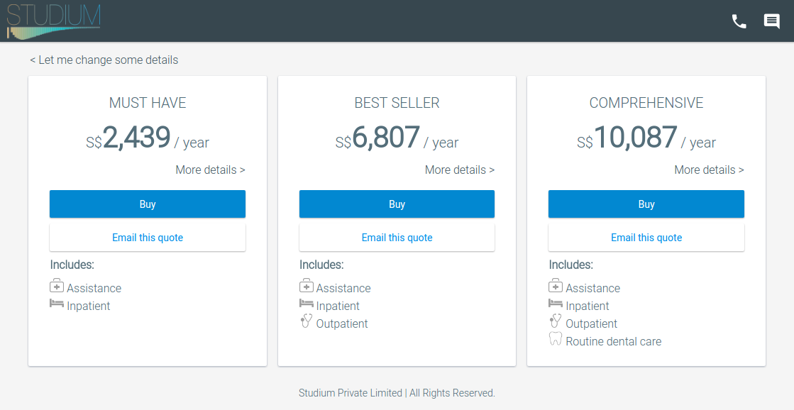

---

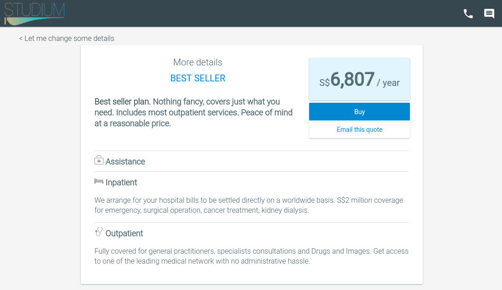

---

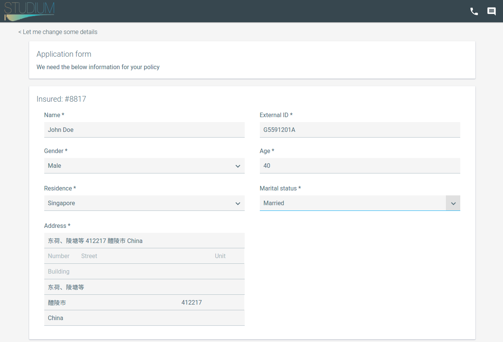

---

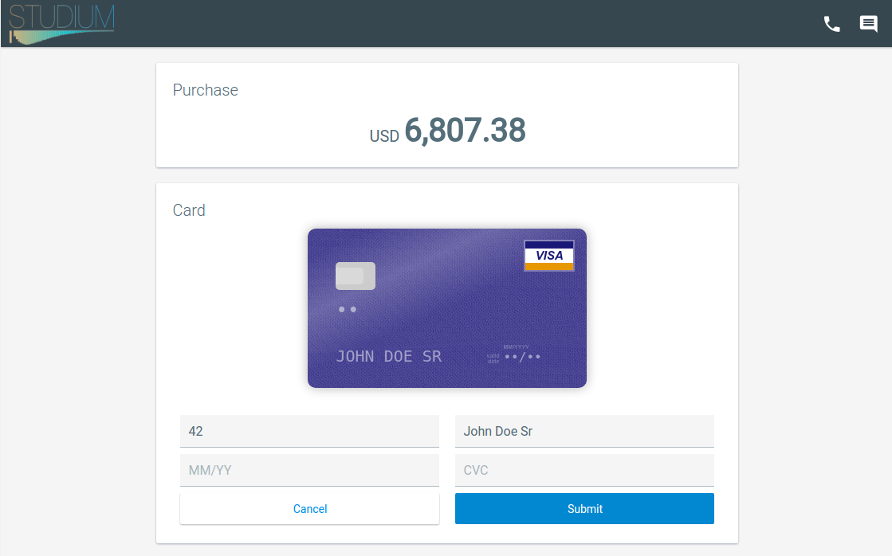

---
#### Technology
Integrated, fully online, works on devices with all screen sizes

---
###### Desktop
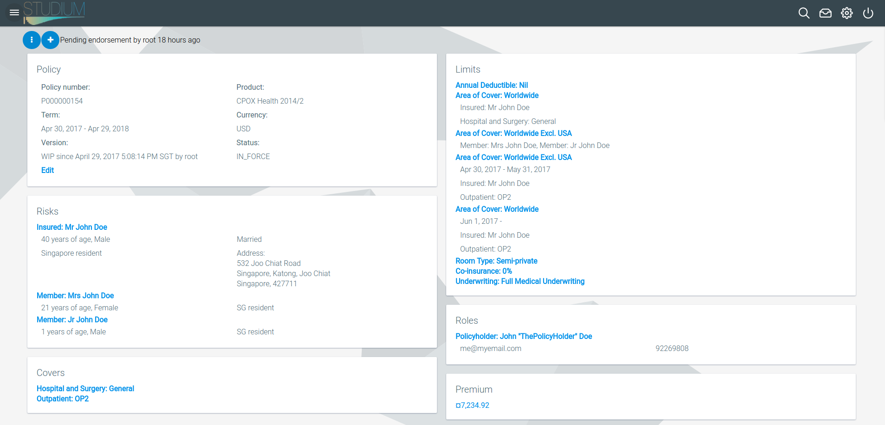

---

###### Tablet
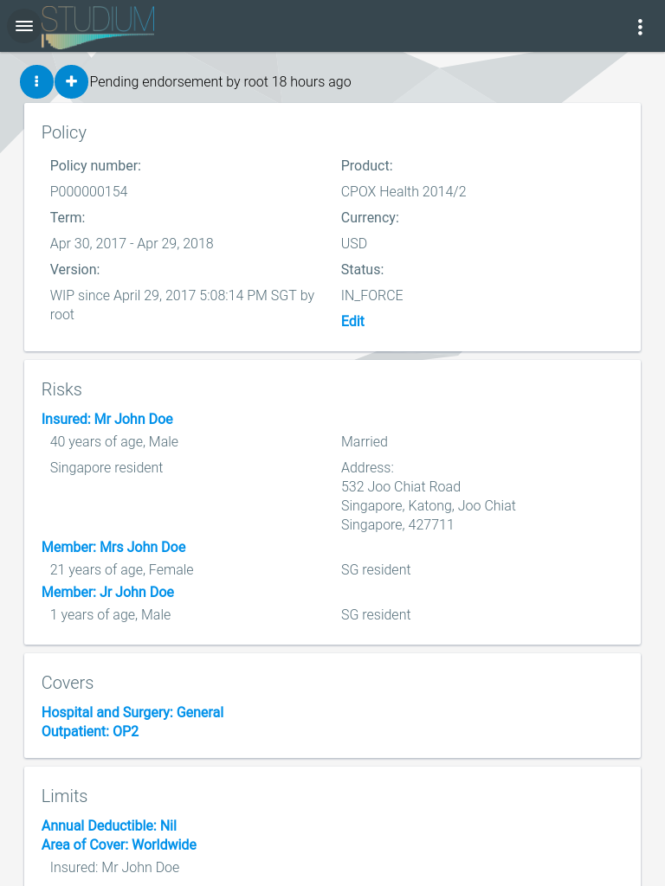

---
###### Phone
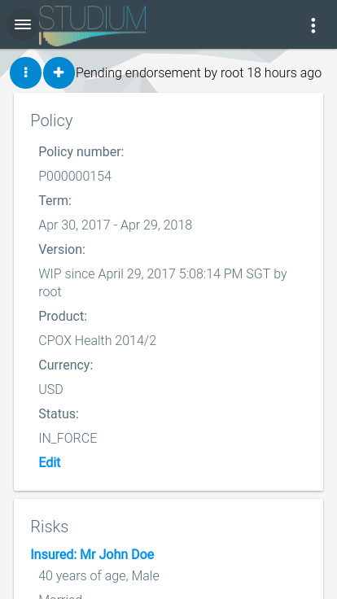

---

#### Client accounts support

Once a client buys a policy, an account is created to her and the link
is sent. The client can self-administer policies / claims from there onwards.

---

#### Intermediary accounts self-management

Intermediaries can sign up with their Google, Facebook, LinkedIn identities,
or just by an email address.

Product access can be granted to them by inhouse staff.

---

Account owners may grant access to other people.

They can administer their own workforce!

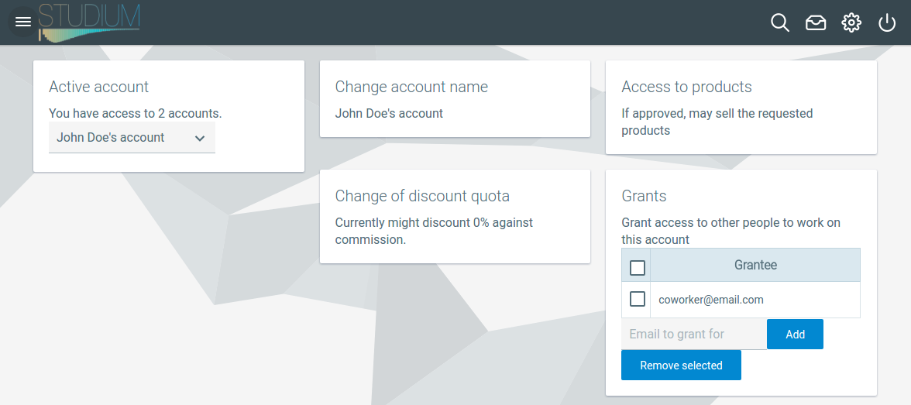

---

#### Policy management

Endorsements

Cancellations

Renewals

---

#### Accounting

Proper pro-rata calculations out of the box.

The results can be fed to any general ledger system.

---

#### Promotional campaigns

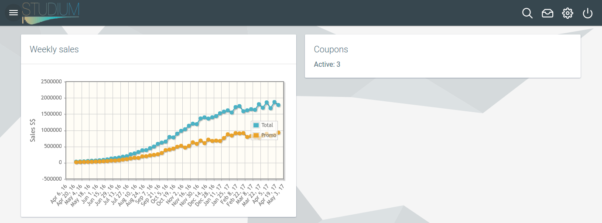

---

#### Coupons

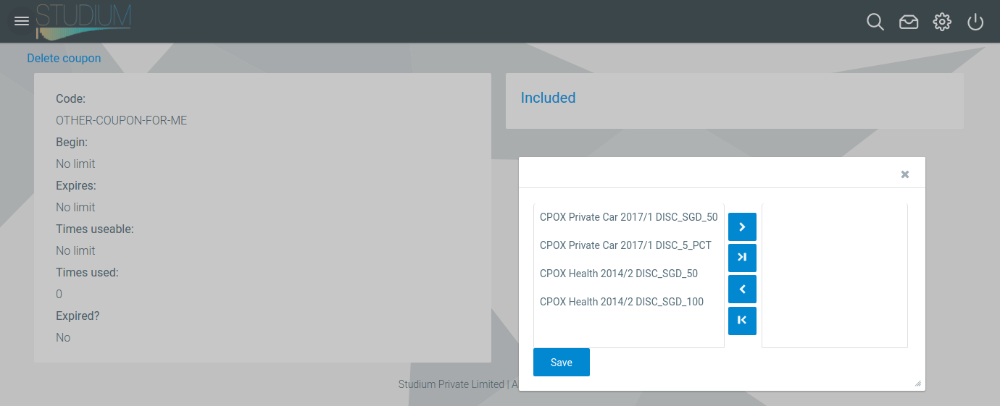

---

#### Data output for analytics

We keep actuaries happy.

- all quotes
- client revisits to those, with request parameters
- success indicators
- all policies
- (...later claims data linked to benefits, planned)

---

#### Specialty products

No problem.
Our data model has the flexibility to support them.

In fact, in our reference products, in-house underwriters are already
able to define granular policy setups like some covers only at some risks
at specific date ranges, the system does the required slice-and-dicing.

---

E.g.

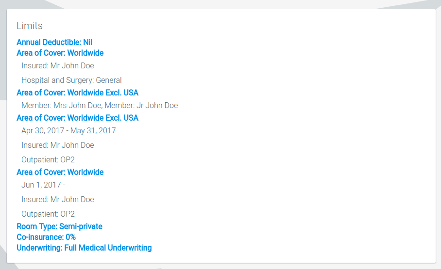

---

#### Performance

<ul style="font-size: 0.6em">
<li>Tested with 10M randomly generated policies</li>
<li>Generation speed 50 policy / second on a single I7 core (single threaded execution)</li>
<li>this includes applying business rules, validation, rating, persisting data to RDBMS</li>
<li>size on disk is 30G</li>
<li>with 10M policies in RDBMS the system performs with the same responsiveness</li>
</ul>

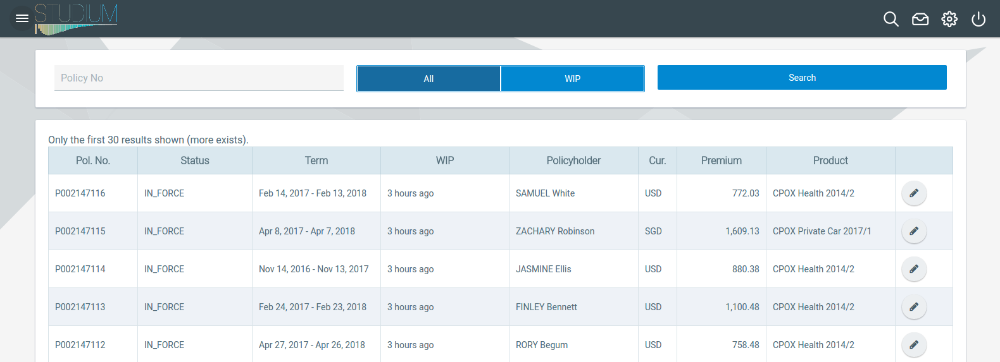

---

#### Response times

All tiers on a development desktop, 10M policies on the user's active account:

<ul style="font-size: 0.8em">
<li>Policy search
    <ul>
    <li>By policy number: 3ms exact, 30ms left substring match</li>
    </ul>
</li>
<li>Partner search
    <ul>
    <li>By name: 400ms +-200, both sides substring match</li>
    <li>By external ID: 10ms +-3 left ~</li>
    <li>By email: 50ms +-40 left ~</li>
    </ul>
</li>
<li>Start / issue endorsement on a policy, display policy, etc: 50ms</li>
</ul>

---

Don't take our word for all this.

#### Give us your product brochure, we come to your office with the products done!