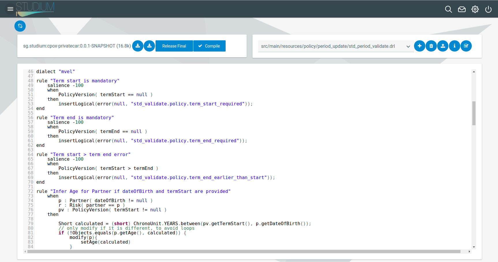

## Quote Engine
Introduction

---

We believe that insurance product implementations should take days not months.

The insurer defines the product,
the engine presents it in a consistent
manner to its target channels: intermediaries, direct clients.

---

The engine sits in front of the existing backend systems of the company.

---

#### Product lifecycle management

A product definition is a self contained entity.

Once it is done, can be saved into a text file and uploaded to the live
environment, where it is usable instantly.

---

##### Product = Structure + Business rules

---

... fields included, with formats and constraints.

---

...and business rules. We have an integrated rules engine
that does the heavy lifting.

---

A rule is a simple thing:

---

The result of all changes can be seen and tested instantly.

Then just upload to production as a new product version.

---

Out of the box client facing UIs

---

---

---

---

---

---
#### Technology
Integrated, fully online, works on devices with all screen sizes

---
###### Desktop

---

###### Tablet

---
###### Phone

---

#### Client accounts support

Once a client buys a policy, an account is created to her and the link
is sent. The client can self-administer policies / claims from there onwards.

---

#### Intermediary accounts self-management

Intermediaries can sign up with their Google, Facebook, LinkedIn identities,
or just by an email address.

Product access can be granted to them by inhouse staff.

---

Account owners may grant access to other people.

They can administer their own workforce!

---

#### Promotional campaigns

---

#### Coupons

---

#### Data output for analytics

We keep actuaries happy.

- all quotes
- client revisits to those, with request parameters
- success indicators
- <a href="https://gitpitch.com/NagyGa1/lrguard-intro" target="__blank">pricing AI</a> integration

---

Don't take our word for all this.

#### Give us your product brochure, we come to your office with the products done!